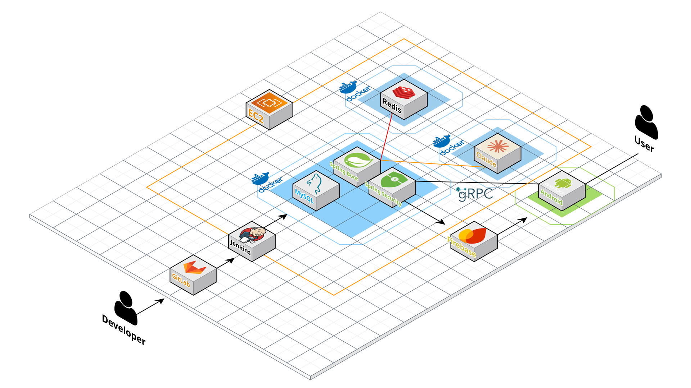
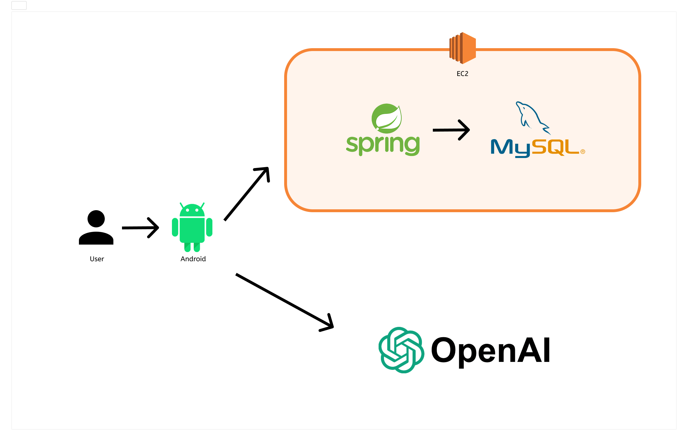

### 👋 안녕하세요, 송진우 입니다.
**앱도 서버도 인프라도, 끝까지 붙이는 개발자**  
Android ⇄ Spring Boot ⇄ k8s를 잇고, 기능은 빠르게 만들되 운영은 안정적으로 지킵니다.

Jetpack Compose · gRPC 실시간 동기화 · Spring Cloud(Gateway/Eureka/Config) · Jenkins+Kaniko · Traefik · cert-manager · Prom/Grafana/Loki · JWT/OAuth

**제가 잘하는 것**
- End-to-End 소유: Android 화면 → 백엔드 API → CI/CD → Ingress/TLS까지 한 흐름으로 설계/운영
- 운영형 문제해결: 재현 스크립트·대시보드·알람으로 MTTR 단축
- 표준화/자동화: Helm 템플릿화, 공통 게이트웨이/보안 정책, 파이프라인 일관화

**가치관**
- “됐네”에서 멈추지 않고 **“돌아간다”까지**. 재현 가능한 버그, 롤백 가능한 배포, 관찰 가능한 운영을 기본으로 합니다.

   

  ## 🚀 Tech Stack

  <!-- 백엔드 -->
  

  
<b>Backend</b>

  
  <!-- Badges: flat으로 통일 -->
  
  
  
  
  
  
  
  
  

  <!-- 안드로이드 -->
  

  
<b>Android</b>

  
  
  
  
  
  
  

  <!-- 인프라/데브옵스 -->
  

  
<b>Infra / DevOps</b>

  
  
  
  
  
  
  
  

   

  ## 🌍 Deployment
  <!-- 운영/배포 한 줄 설명 (실서비스/학습 인프라 구분) -->
  - AWS EC2 위 **k3s** 단일 노드 클러스터 운영 (Traefik Ingress, Helm, Let’s Encrypt)
  - **Jenkins + Kaniko** 로 멀티 스테이지 도커 이미지 빌드 → 쿠버네티스 자동 배포
  - Spring Cloud (Gateway / Eureka / Config)로 MSA 구성, **JWT/OAuth** 인증 통합

   

## 💼 Projects

<table>
  <tr>
  <td>
    <b>WISL</b> — 솔루션 마켓(문제→팀빌딩→펀딩→출시) 플랫폼 · K-PaaS 공모전(진행중) 
    
      
      
      
      
      
      
      
      
      
      
      
      
      
      
      
      
      
      
     

 

  

    
<b>개요 & 목표</b>

    <ul>
      <li><b>배경</b>:<b>소비자 문제를 출발점</b>으로 펀딩·출시까지 이어주는 플랫폼 필요</li>
      <li><b>목표</b>: <b>실제 문제</b> 중심의 검증형 혁신 · K-PaaS 기반 서비스화</li>
      <li><b>핵심 값</b>: 커뮤니티 검증(공감/참여 데이터) → 리스크↓, 수익 <b>투명 분배</b></li>
    </ul>
  

  

    
<b>핵심 기능(트랙 A/B)</b>

    <ul>
      <li><b>트랙 A · 아이디어 대나무숲</b>: 문제 제기·공감 수치화, 유사 문제 자동 묶기(분류)</li>
      <li><b>트랙 B · Co-Create(비공개)</b>: e-NDA로 보호된 기획 공유, 제안 수령, 전자계약(SoW/저작권/분배)</li>
      <li><b>펀딩/검증</b>: 리워드/선주문 연동, 베타 테스트 피드백 루프</li>
      <li><b>정산/분배</b>: 마일스톤·에스크로 기반 자동 정산(문제제기자/개발팀/후원자)</li>
    </ul>
  

  

    
<b>주요 기술</b>

    <ul>
      <li><b>Android</b>: Kotlin, Jetpack Compose, MVVM/Repository 또는 Cross-Platform</li>
      <li><b>Backend</b>: Spring Boot, MyBatis + MySQL, REST API, MSA, Postgre, Kafka, Redis 등 </li>
      <li><b>Infra</b>: AWS EC2 배포, Kubernetes, NCP 등 (K-PaaS 연동 계획)</li>
    </ul>
  

  

    
<b>기대 효과</b>

    <ul>
      <li><b>수요 검증</b> 기반 개발로 실패 리스크↓</li>
      <li>문제 제기자·개발자·후원자 간 <b>투명한 수익 공유</b></li>
      <li>지역/커뮤니티 단위의 <b>문제 해결 촉진</b></li>
    </ul>
  

</td>
</tr>

  <tr>
    <td>
      <b>HelloWorld</b> — 임산부 케어 앱 (Android Compose + Spring Cloud MSA) 
      
        
        
        
        
        
        
        
        
        
        
       

   

  

    
<b>내 주요 기여(Infra)</b>

    <ul>
      <li><b>클러스터</b>: AWS EC2 위 <b>k3s</b> 구성, 네임스페이스(ingress/apps/db/observability) 분리</li>
      <li><b>배포</b>: <b>Jenkins + Kaniko</b> 이미지 빌드·푸시 → Helm/kubectl로 자동 롤링 업데이트</li>
      <li><b>네트워킹</b>: <b>Traefik Ingress</b>, <b>cert-manager</b>로 Let’s Encrypt 자동 TLS, X-Forwarded 헤더 정합</li>
      <li><b>MSA</b>: Spring Cloud <b>Gateway / Eureka / Config</b> 부트스트랩, JWT/OAuth 엔드포인트 집약</li>
      <li><b>데이터</b>: PostgreSQL(서비스별 DB), <b>Redis</b> 캐시/세션, Loki/Promtail 로그 수집, Grafana 대시보드</li>
    </ul>
  

  🔗 <a href="YOUR_HELLOWORLD_REPO">Repo</a> · <a href="https://www.notion.so/254b8bebd93a8057b1cdf2d9cf6d589b?source=copy_link">Docs</a>
  </td>
  </tr>

  <tr>
  <td>
    <b>BookgleBookgle</b> — 실시간 PDF 협업 플랫폼 (Android + Spring Boot + gRPC) 
    
      
      
      
      
    
    
   

   

  

    
<b>내 주요 기여</b>

    <ul>
    <li><b>Android</b>: Jetpack Compose 기반 UI/UX, 커스텀 PDF Viewer(페이지 썸네일·하이라이트·주석),
        <b>gRPC 페이지 동기화</b> 및 충돌 처리, Hilt/Room, JWT 인증 연동</li>

    <li><b>Infra</b>: AWS EC2에 <b>Docker</b>로 서비스 컨테이너라이징, 
        <b>docker-compose</b>로 멀티 서비스 구성·배포, 
        <b>Jenkins</b>로 빌드/배포 자동화</li>
    <li><b>Server</b>: Spring Boot 기반 gRPC 서버(프로토콜 정의/인터셉터), 인증(JWT)·권한 처리 협업</li>
    </ul>
  

  🔗 <a href="https://github.com/openSongce/bookglebookgle">Repo</a> · <a href="https://www.notion.so/D204-230bf1e01d1e807d9a45eee0cd9208ec?source=copy_link">Docs</a>
  </td>
</tr>

  <tr>
  <td>
    <b>NHCafe</b> — 음성인식 기반 AI 무인 카페 앱 (Android + Spring Boot + GPT-4o) 
    
      
      
      
      
      
      
      
      
      
      
     

   

  

    
<b>내 주요 기여(Android · AI)</b>

    <ul>
      <li><b>대화형 주문</b>: 음성(STT) → 텍스트 → <b>GPT-4o</b>로 의도/메뉴 파싱 → 주문 카드 자동 구성</li>
      <li><b>음성 안내</b>: 주문 단계·확인 내용을 <b>TTS</b>로 낭독, 시각/청각 동시 안내</li>
      <li><b>추천 메뉴</b>: 프롬프트 정책으로 실제 메뉴 중 <b>3가지 추천</b> 응답</li>
      <li><b>앱 구조</b>: <b>MVVM + Repository</b>, Compose UI 상태관리, Retrofit 네트워킹</li>
      <li><b>서버 연동</b>: Spring Boot + <b>MyBatis/MySQL</b> 주문/메뉴 API, AWS EC2 배포 협업</li>
    </ul>
  

  🔗 <a href="https://github.com/openSongce/NHCafe">Repo</a>
  </td>
</tr>

  <tr>
    <td>
      <b>RouteMap / Broaf</b> — 지도 기반 여행·SNS (Kakao Map API) 
      경로 표시·리스트 UI, 성능 최적화(지연 로딩), Firebase → Spring 전환 준비 
      모바일 UI/UX(XML 레이아웃), RecyclerView(Adapter·ViewHolder) 구성, Kakao Map 중심 각종 외부 API 연동 
      🔗 <a href="https://github.com/openSongce/Routemap">RouteMap</a> · <a href="https://github.com/openSongce/broaf">Broaf</a>
    </td>
  </tr>
  

</table>

 

  ## 📊 GitHub Stats
  <!-- 통계 위젯은 취향껏 1~2개만 사용해도 충분 -->
  
  
  <!--  -->

   

  ## 🔥 Contact & More
  
  

    

  <!-- 작은 디테일: 방문자수 배지 -->
  

